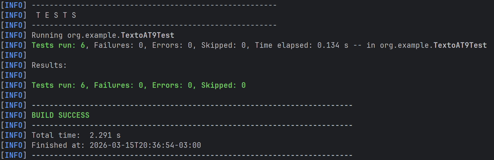

# Ejercicio 14
## Conversor Texto a T9.

Esta tarea consiste en implementar un conversor de texto a formato T9 que pueda leer y procesar un archivo y tambien invierta el texto procesado.

## Requisitos esperados.
- Estrcutura Maven (src/main/java, src/test/java).
- Implementacion de logica T9 e inversion del mismo.
- Test con JUnit 5 (un test basico, otro parametrizado, otro que maneje excepciones, y por ultimo un test que valide el timeout).

## Intrucciones para ejecutar los test.

- Ejecutar comando 'mvn clean test' en la terminal.

## Evidencia de que los test pasaron con exito.

