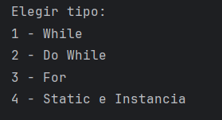
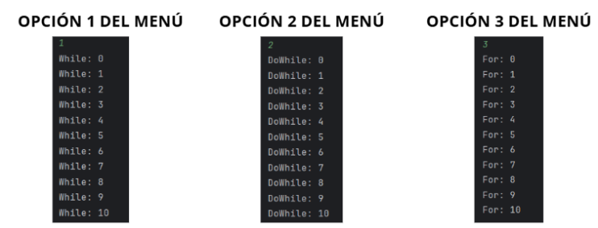

UT0 - Ejercicio 3: Contador incremental y control de flujo
-

**Punto 1:** Agregar un menú simple con switch que permita elegir qué variante de conteo ejecutar.

**Visualización del menú:**
Se creó el menú utilizando switch, aparecen las 4 opciones para poder elegir el tipo

**Visualización al ejecutar cada opción del menú**

Al seleccionar cada opción imprime cada valor del contador hasta llegar a 10.

**Punto 2:** Explicar en no más de diez líneas en qué casos usarías while, do-while y for.

* While se usa cuando no sabemos exactamente cuántas iteraciones se realizarán y queremos evaluar la condición antes de ejecutar el bloque de código.
* Do-while es similar a while, pero garantiza que el bloque se ejecute al menos una vez, porque la condición se evalúa después.
* For se utiliza cuando conocemos la cantidad de iteraciones en la estructura del ciclo.

**Punto 3:** Incluir una demostración breve de la diferencia entre un atributo static y uno de instancia dentro de la misma clase o en una clase auxiliar.

* Un atributo static pertenece a la clase, su valor es compartido por todos los objetos creados a partir de ella.
* Un atributo de instancia pertenece a cada objeto, por lo que cada instancia puede tener su propio valor.