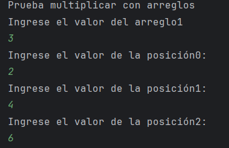
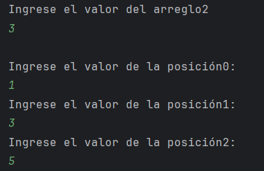
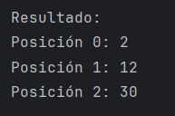
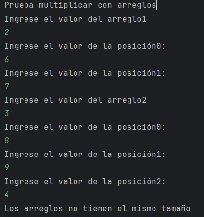

UT0 - Ejercicio 6: Metodos reutilizables, sobrecarga y arreglos numericos
-

**Punto 1:** Explicación breve de la sobrecarga implementada.

La sobrecarga pasa cuando varias métodos tienen el mismo nombre, pero con diferentes parámetros.
En el ejercicio se implementa 2 veces el método "multsuma", en uno trabaja con int y en el otro con double

**Punto 2:** Ejemplos de ejecución con arreglos válidos e inválidos. 

**Ejemplo multsuma con int:**

**Ejemplo multsuma con double:**

**Ejemplo multiplicación de arreglos - CASO VÁLIDO**

Primero se le solicita al usuario el valor de cada posición del arreglo 1

Luego se le solicita al usuario el valor de cada posición del arreglo 2

Se multiplica y muestra el reusltado:

En este caso:
* Arreglo 1: [2,4,6]
* Arreglo 2: [1,3,5]

Se multiplicó:
* 2*1
* 4*3
* 6*5

**Ejemplo multiplicación de arreglos - CASO INVÁLIDO**

