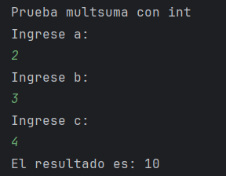
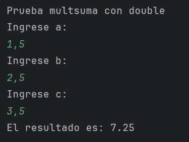

UT0 - Ejercicio 6: Metodos reutilizables, sobrecarga y arreglos numericos
-

Implementar la multiplicación de dos vectores o arreglos de enteros, validando previamente si la operación es posible según la interpretación elegida.

Explicar en lenguaje natural la estrategia usada para validar y calcular.

Separar entrada, cálculo y salida en métodos distintos.

**Punto :** Explicación breve de la sobrecarga implementada.

La sobrecarga pasa cuando varias métodos tienen el mismo nombre, pero con diferentes parámetros.
En el ejercicio se implementa 2 veces el método "multsuma", en uno trabaja con int y en el otro con double

Ejemplos de ejecución con arreglos válidos e inválidos. 

**Ejemplo multsuma con int:**

**Ejemplo multsuma con double:**

